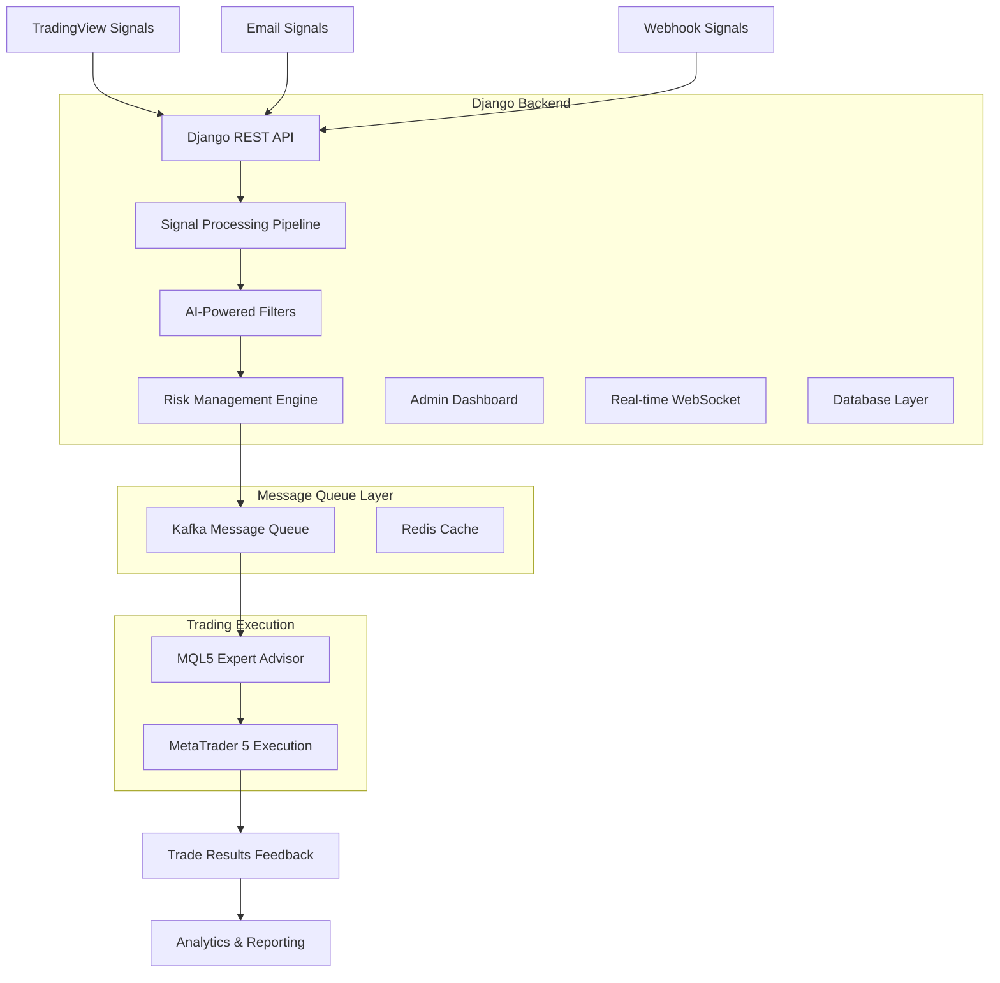

# 🚀 MikroBot-MCP - Intelligent Trading Signal Bridge

> **Next-generation automated trading framework** built with Django, designed to process external trading signals (TradingView, webhooks, email) and execute precision trades via MetaTrader 5 with advanced risk management.


---

## 📋 Table of Contents

- [🎯 What is MikroBot-MCP?](#-what-is-mikrobot-mcp)
- [🏗️ Why Django?](#️-why-django)
- [⚡ Architecture Overview](#-architecture-overview)
- [🛠️ Current Implementation Status](#️-current-implementation-status)
- [🚀 Getting Started](#-getting-started)
- [📊 Project Structure](#-project-structure)
- [🔧 Technology Stack](#-technology-stack)
- [📈 Roadmap](#-roadmap)
- [🤝 Contributing](#-contributing)

---

## 🎯 What is MikroBot-MCP?

**MikroBot-MCP** (Model Control Protocol) is a **multi-agent trading intelligence framework** that bridges external trading signals with MetaTrader 5 execution. It's designed for professional traders who need:

- **Signal Automation**: Receive signals from TradingView, webhooks, or email
- **Intelligent Filtering**: AI-powered signal validation and risk assessment
- **Precision Execution**: Reliable order routing to MetaTrader 5 via Kafka
- **Risk Management**: Advanced position sizing and portfolio protection
- **Real-time Analytics**: Performance tracking and optimization insights

### 🎪 The Problem We Solve

Traditional trading bots are either:

- **Too Simple**: Basic signal forwarding without intelligence
- **Too Complex**: Monolithic systems that are hard to maintain
- **Too Rigid**: Can't adapt to different signal sources or brokers

**MikroBot-MCP** provides a **modular, scalable, and intelligent** solution that grows with your trading needs.

---

## 🏗️ Why Django?

### Enterprise-Grade Web Framework

**Django** isn't just a web framework—it's a **complete business application platform** that provides exactly what professional trading systems need:

#### 🔒 **Built-in Security**

```python
# Django handles automatically:
- CSRF protection
- SQL injection prevention
- XSS protection
- User authentication & authorization
- Secure session management
```

#### 🗄️ **Powerful ORM (Object-Relational Mapping)**

```python
# Instead of writing SQL:
SELECT * FROM signals WHERE status = 'pending' AND symbol = 'EURUSD';

# Write clean Python:
signals = Signal.objects.filter(status='pending', symbol='EURUSD')
```

#### 🎛️ **Admin Interface Out-of-the-Box**

- **Zero-code admin panel** for managing signals, trades, and analytics
- **Instant CRUD operations** for all data models
- **User management** and **permissions system**
- **Perfect for non-technical traders** to monitor and control the system

#### 🔄 **Scalable Architecture**

```python
# Modular apps that can scale independently:
- signals/     → Handle incoming signals
- trading/     → Execute trade logic
- analytics/   → Generate reports
- notifications/ → Send alerts
- core/        → Shared utilities
```

#### 🌐 **REST API Ready**

```python
# Django REST Framework provides:
- Automatic API documentation
- Serialization/deserialization
- Authentication & permissions
- Rate limiting
- Filtering & pagination
```

### Perfect for Trading Systems

**Why Django excels for financial applications:**

1. **Data Integrity**: ACID-compliant transactions ensure no lost trades
2. **Concurrent Processing**: Handle multiple signals simultaneously
3. **Background Tasks**: Celery integration for async trade processing
4. **Message Queues**: Kafka integration for reliable order routing
5. **Monitoring**: Built-in logging and debugging tools
6. **Compliance**: Audit trails and data retention policies

---

## ⚡ Architecture Overview



### 🎯 **Signal Flow Pipeline**

1. **📥 Signal Ingestion**: Multiple input sources (TradingView, email, webhooks)
2. **🔍 Signal Processing**: Parse, normalize, and validate incoming signals
3. **🧠 Intelligent Filtering**: AI-powered signal quality assessment
4. **⚖️ Risk Management**: Position sizing, exposure limits, correlation analysis
5. **📨 Message Queuing**: Reliable signal routing via Kafka
6. **💹 Trade Execution**: MetaTrader 5 via custom MQL5 Expert Advisor
7. **📊 Performance Tracking**: Real-time analytics and optimization feedback

---

## 🛠️ Current Implementation Status

### ✅ **Phase 1: Foundation (COMPLETED)**

**Professional Django Setup:**

- ✅ **Virtual Environment**: Isolated Python 3.13 environment with `.venv`
- ✅ **Django 5.2.4**: Latest stable release with security updates
- ✅ **Modular Architecture**: 5 dedicated Django apps for separation of concerns
- ✅ **REST API Ready**: Django REST Framework configured with authentication
- ✅ **CORS Support**: Frontend integration prepared
- ✅ **Development Server**: Running and accessible at `http://127.0.0.1:8000/`

**Application Structure:**

```python
INSTALLED_APPS = [
    # Django Core
    'django.contrib.admin',
    'django.contrib.auth',
    'django.contrib.contenttypes',
    'django.contrib.sessions',
    'django.contrib.messages',
    'django.contrib.staticfiles',

    # Third Party
    'rest_framework',    # REST API functionality
    'corsheaders',       # Cross-origin resource sharing

    # MikroBot Apps
    'signals',           # Signal processing pipeline
    'trading',           # Trade execution logic
    'analytics',         # Performance analytics
    'notifications',     # Alert system
    'core',             # Shared utilities
]
```

**Security & Configuration:**

- ✅ **Time Zone**: Configured for `Europe/Helsinki`
- ✅ **Authentication**: Token-based API authentication
- ✅ **Permissions**: Secure API endpoints with proper authorization
- ✅ **Pagination**: Efficient data handling with 50-item pages
- ✅ **Database**: SQLite for development (PostgreSQL ready for production)

### 🚧 **Phase 2: Core Models (IN PROGRESS)**

**Next Milestones:**

- 📝 **Signal Data Models**: Define database schema for trading signals
- 🎛️ **Admin Interface**: Set up management dashboard for signals
- 🔌 **Webhook Endpoints**: Create API endpoints for signal reception
- 🧪 **Database Migrations**: Initialize and manage database schema
- 👤 **User Management**: Create superuser and authentication system

### 🔄 **Phase 3: Business Logic (PLANNED)**

- **Signal Processing Pipeline**: Intelligent filtering and validation
- **Risk Management Engine**: Position sizing and exposure control
- **Kafka Integration**: Message queue for reliable trade routing
- **Background Tasks**: Asynchronous processing with Celery
- **Real-time WebSockets**: Live updates for dashboard

### 📈 **Phase 4: Advanced Features (PLANNED)**

- **Machine Learning Filters**: AI-powered signal quality scoring
- **Multi-Broker Support**: Extend beyond MetaTrader 5
- **Advanced Analytics**: Performance attribution and optimization
- **Telegram Bot**: Mobile notifications and control
- **High Availability**: Production deployment with load balancing

---

## 🚀 Getting Started

### Prerequisites

- **Python 3.13+**
- **Git**
- **Virtual Environment Support**

### Installation

```bash
# 1. Clone the repository
git clone https://github.com/yourusername/mikrobot-mcp.git
cd mikrobot-mcp

# 2. Create and activate virtual environment
python -m venv .venv
.venv\Scripts\activate  # Windows
# source .venv/bin/activate  # Linux/Mac

# 3. Install dependencies
pip install -r requirements.txt

# 4. Run development server
python manage.py runserver
```

### 🎯 **Quick Verification**

Visit `http://127.0.0.1:8000/` - you should see the Django welcome page with a rocket! 🚀

---

## 📊 Project Structure

```
mikrobot_mcp/
├── 📁 .venv/                    # Virtual environment
├── 📁 mikrobot_mcp/             # Django project settings
│   ├── 📄 settings.py           # Main configuration
│   ├── 📄 urls.py               # URL routing
│   └── 📄 wsgi.py               # WSGI configuration
├── 📁 signals/                  # Signal processing app
│   ├── 📄 models.py             # Signal data models
│   ├── 📄 views.py              # API endpoints
│   ├── 📄 serializers.py        # Data serialization
│   └── 📄 admin.py              # Admin interface
├── 📁 trading/                  # Trading execution app
│   ├── 📄 models.py             # Trade models
│   ├── 📄 executors.py          # Trade execution logic
│   └── 📄 risk_manager.py       # Risk management
├── 📁 analytics/                # Performance analytics
├── 📁 notifications/            # Alert system
├── 📁 core/                     # Shared utilities
├── 📄 manage.py                 # Django management script
├── 📄 requirements.txt          # Python dependencies
├── 📄 db.sqlite3                # Development database
└── 📄 README.md                 # This file
```

---

## 🔧 Technology Stack

### **Backend Framework**

- **Django 5.2.4** - Enterprise web framework
- **Django REST Framework 3.16.0** - API development
- **Python 3.13** - Modern Python features

### **Database & Caching**

- **SQLite** (Development) / **PostgreSQL** (Production)
- **Redis** - Caching and session storage

### **Message Queue**

- **Apache Kafka** - Reliable message streaming
- **Celery** - Background task processing

### **API & Integration**

- **CORS Headers** - Cross-origin support
- **Token Authentication** - Secure API access
- **Webhook Support** - External signal integration

### **Development Tools**

- **Virtual Environment** - Dependency isolation
- **Django Admin** - Built-in management interface
- **Django Debug Toolbar** - Development debugging
- **Git** - Version control

### **Planned Integrations**

- **MetaTrader 5** - Trade execution platform
- **TradingView** - Signal source
- **Telegram Bot API** - Mobile notifications
- **Docker** - Containerized deployment

---

## 📈 Roadmap

### 🎯 **Q1 2025 - Core Foundation**

- [x] Django project setup with modular architecture
- [x] REST API framework configuration
- [x] Development environment optimization
- [ ] **Database models for signals and trades**
- [ ] **Admin interface for signal management**
- [ ] **Basic webhook endpoints**

### 🎯 **Q2 2025 - Intelligence Layer**

- [ ] **Signal processing pipeline**
- [ ] **Risk management engine**
- [ ] **Kafka message queue integration**
- [ ] **Background task processing**
- [ ] **Real-time WebSocket connections**

### 🎯 **Q3 2025 - Trading Execution**

- [ ] **MetaTrader 5 MQL5 Expert Advisor**
- [ ] **Trade execution and management**
- [ ] **Performance analytics dashboard**
- [ ] **Telegram bot integration**
- [ ] **Advanced filtering algorithms**

### 🎯 **Q4 2025 - Production Ready**

- [ ] **Machine learning signal scoring**
- [ ] **Multi-broker support**
- [ ] **High availability deployment**echo
- [ ] **Comprehensive testing suite**
- [ ] **Production monitoring**

---

## 🤝 Contributing

We welcome contributions! This project follows professional development practices:

### Development Workflow

1. **Fork** the repository
2. **Create feature branch**: `git checkout -b feature/amazing-feature`
3. **Make changes** following Django best practices
4. **Write tests** for new functionality
5. **Commit changes**: `git commit -m 'Add amazing feature'`
6. **Push to branch**: `git push origin feature/amazing-feature`
7. **Open Pull Request** with detailed description

### Code Standards

- **PEP 8** Python style guide
- **Django conventions** for models, views, and URLs
- **REST API best practices** for endpoints
- **Comprehensive documentation** for all functions
- **Unit tests** for critical functionality

---

## 📜 License

This project is licensed under the **MIT License** - see the [LICENSE](LICENSE) file for details.

---

## 🙏 Acknowledgments

- **Django Community** - For building an incredible framework
- **TradingView** - For providing excellent charting and signal capabilities
- **MetaQuotes** - For MetaTrader 5 platform
- **Apache Kafka** - For reliable message streaming
- **Python Community** - For continuous language improvements

---

<div align="center">

**Built with ❤️ for professional traders who demand reliability, intelligence, and scalability.**

[⭐ Star this repo](https://github.com/yourusername/mikrobot-mcp) | [🐛 Report Bug](https://github.com/yourusername/mikrobot-mcp/issues) | [💡 Request Feature](https://github.com/yourusername/mikrobot-mcp/issues)

</div>

TESTI !